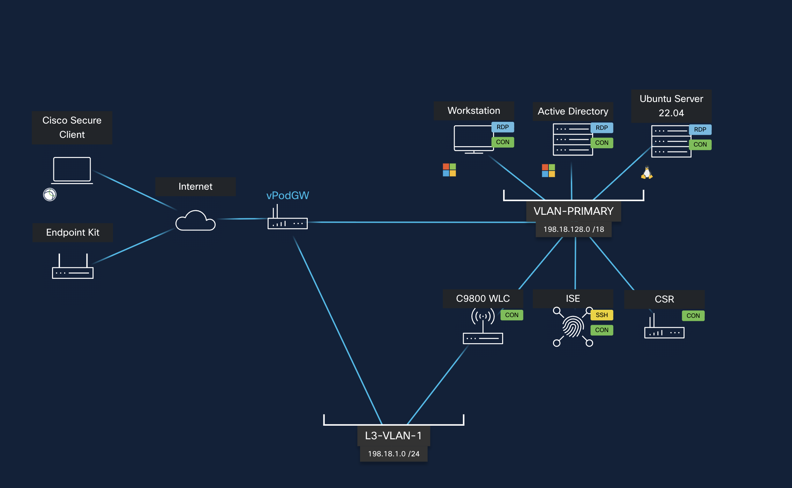
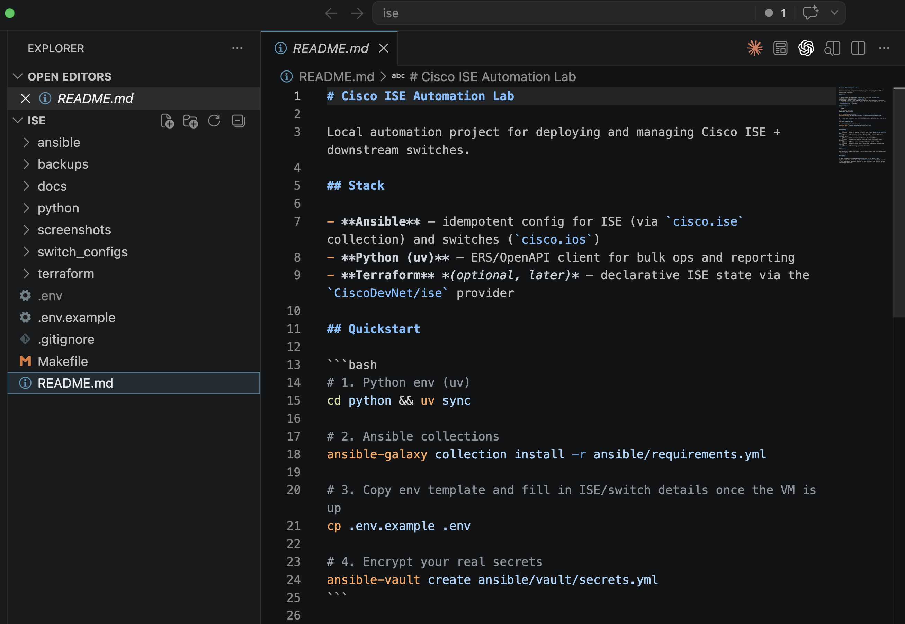
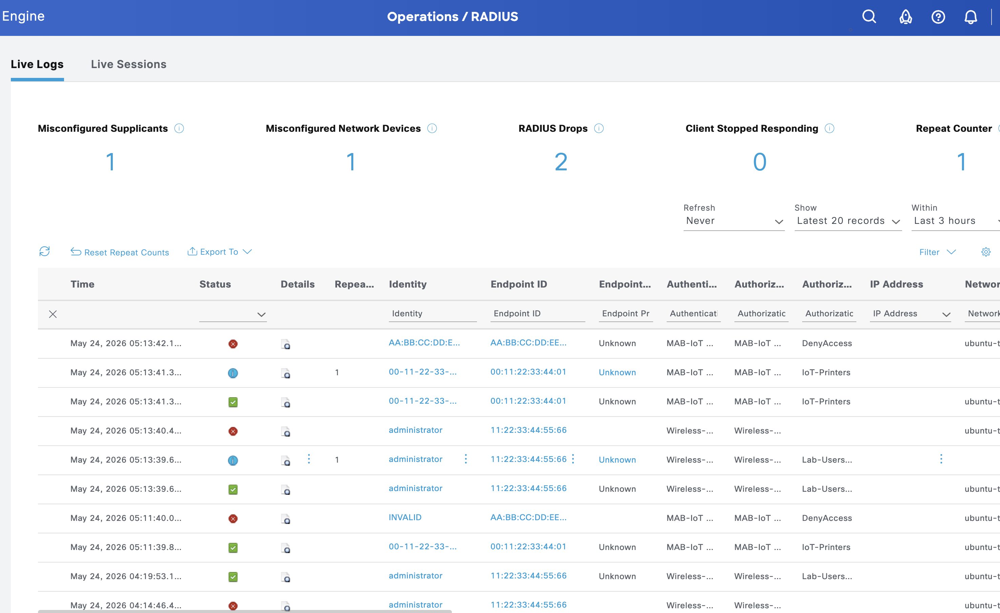
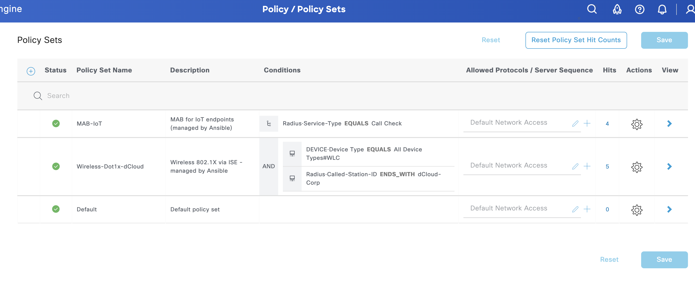
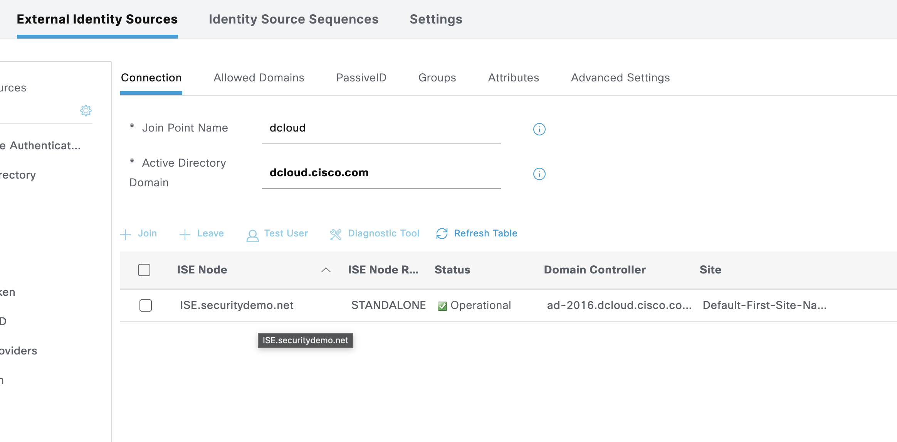
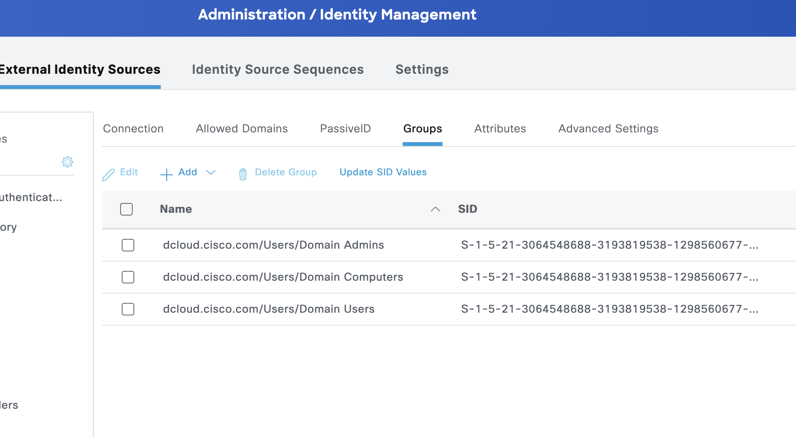
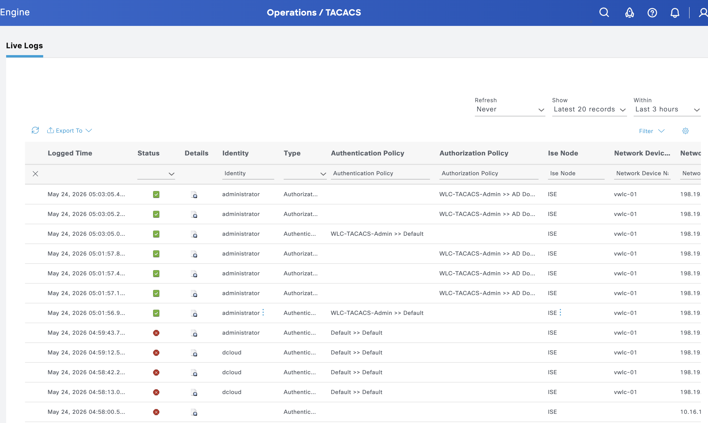

# Building a Production-Grade Cisco ISE Deployment in One Sitting — With AI as My Pair

I've configured Cisco ISE more times than I'd like to admit. Network Device Groups, AD joins, policy sets, authorization profiles, TACACS+ device admin, MAB for IoT — every deployment hits the same rhythm: a week of clicking through admin screens, a sprint of "wait, why isn't this matching?", and a final lap of building runbooks nobody will read.

Last week I sat down with [Claude](https://claude.ai/) and a [Cisco dCloud](https://dcloud.cisco.com/) sandbox to try something different: build the whole thing **as code**, end-to-end, in one evening. AD-integrated wireless 802.1X. TACACS+ admin login. MAB for IoT endpoints. VLAN + dACL push. Config snapshots. Smoke tests.

It worked. The repo is here: **[github.com/asarmiento85/cisco-ise-automation](https://github.com/asarmiento85/cisco-ise-automation)**.

This post is the story of what we built, the ISE 3.4 paper-cuts we hit along the way, and why I think this pattern — engineer + LLM + good APIs — is going to change how NAC work gets done in the field.

---

## The lab

A standard Cisco dCloud ISE 3.4 sandbox: one ISE PAN, one Catalyst 9800-CL virtual WLC, a Windows Server 2016 AD DC, a Windows workstation, and an Ubuntu 22.04 host I'd use as my RADIUS test client. Everything on RFC-reserved IP space, reachable over AnyConnect VPN.



The only thing not in the diagram: my MacBook, where Ansible and Python would run against everything else over the VPN tunnel.

## The stack

Three deliberate choices that mattered:

1. **Ansible for orchestration**, but using `ansible.builtin.uri` to hit ISE's ERS and OpenAPI directly. The `cisco.ise` collection exists but has real schema drift against ISE 3.4 — I burned 30 minutes fighting it before switching strategies. Raw API calls turned out to be more predictable and easier to debug.
2. **Python + uv** for the bits Ansible isn't great at: bulk ops, structured config exports, restore replays, smoke tests with rich output.
3. **`cisco.ios`** for the WLC over `network_cli`, since the C9800 is just IOS-XE with extra wireless models.

uv has been a quiet revelation for me. `uv sync` and `uv tool install ansible-core --with ciscoisesdk --with paramiko` are the only two commands needed to bootstrap a working environment on a fresh machine.

## What got built

The repo structure tells the story better than I can:



Each playbook does one job and is idempotent. Re-running anything is safe — `make bootstrap` twice does nothing the second time. That property alone is worth the effort: it means the playbooks ARE the documentation, because they always accurately describe the desired state.

The use cases I wanted to cover:

| Layer | What got automated |
|---|---|
| ISE bootstrap | Network Device Groups (Location / Device Type), baseline identity groups |
| Network devices | vWLC and Ubuntu test host registered as NADs (with the right group hierarchy — more on that below) |
| AD integration | Join point creation, group import (`Domain Users`, `Domain Computers`, `Domain Admins`) |
| Wireless 802.1X | Policy set matching `Device Type=WLC AND SSID=dCloud-Corp`, AuthN via AD, AuthZ pushing VLAN + dACL per session |
| Device admin | TACACS+ policy set for WLC management, shell profiles for full-admin and read-only, AD-backed authN |
| IoT / MAB | Endpoint Identity Groups (Printers, Cameras), seed MACs, policy set for `Service-Type=Call-Check` with VLAN push |
| WLC | RADIUS + AAA method lists, CoA listener, WPA2-Enterprise SSID, TACACS+ client config |
| Operations | Config snapshot/restore (with secret redaction), 4-case end-to-end smoke test |

## Proof it works

The most satisfying part: ISE's RADIUS Live Logs lit up with real auth events from our smoke tests.



What you're looking at:
- **`administrator`** entries → AD user hitting the `Wireless-Dot1x` policy set, getting `Lab-Users-Profile` (VLAN 10 + permit-all dACL)
- **`00-11-22-33-44-01`** → our seed IoT printer MAC, hitting the `MAB-IoT` policy set, getting `IoT-Printers` (VLAN 30)
- **`AA-BB-CC-DD-E…`** with red ❌ → deliberately unknown MAC hitting `MAB-IoT` then `DenyAccess` because no rule matched — proves the policy is actually enforcing, not just rubber-stamping

The Policy Sets view in ISE shows what got built, with hit counts confirming traffic actually landed:



Three policy sets, all enabled, all hitting. `MAB-IoT` and `Wireless-Dot1x-dCloud` both above `Default`, with conditions exactly as written in the playbooks.

The AD join point is operational with the groups we need:





And for the TACACS+ device admin chain, the live logs show AD users SSH'ing into the WLC:



Auth → AD lookup → shell profile applied → priv level enforced on the network gear. That's the loop that used to take a half-day to wire up by hand.

## The smoke test that closes the loop

`make radius-test` runs four scenarios from the Ubuntu host against ISE:

```
AD positive   (administrator + correct pw)        → PASS Access-Accept
AD negative   (administrator + wrong pw)          → PASS Access-Reject
MAB positive  (known printer 00:11:22:33:44:01)   → PASS Access-Accept
MAB negative  (unknown MAC aa:bb:cc:dd:ee:ff)     → PASS Access-Reject
```

Every scenario validates a different path through the policy engine. The Access-Accept for the AD user comes back with `Tunnel-Type=VLAN, Tunnel-Private-Group-Id=10, Cisco-AVPair=ACS:CiscoSecure-Defined-ACL=#ACSACL#-LAB-PERMIT-ALL` — exactly the attribute push we'd want on a real wireless deployment.

## The landmines (this is the actually useful part)

ISE deployments don't fail in the documented ways. They fail in tiny, undocumented, "wait, why is this empty?" ways. Here are the ones we hit and pinned down:

**1. ISE 3.4 ERS silently drops leaf Network Device Groups on POST.** Send a NAD with `Device Type#All Device Types#WLC` in `NetworkDeviceGroupList` and the API returns 201 — but if you re-fetch the object, only `Device Type#All Device Types` (the parent) is set. The fix: follow up the POST with an immediate PUT containing the same list. Then ISE saves it. This one cost me 90 minutes of "why isn't my policy matching?"

**2. `joinDomainWithAllNodes` returns empty HTTP 500s.** The endpoint exists, accepts the right payload, and just… returns 500 with an empty body. No error message, no logs that match. I tried bare usernames, UPN format, NetBIOS format, multiple recreates of the join point. Eventually fell back to one manual click in the GUI for that single operation. Everything else around AD is automated; the join itself isn't. Worth it.

**3. TACACS+ port 49 stays closed until you explicitly enable the Device Admin Service persona on the node.** ISE's API for TACACS objects responds 200 regardless. You can create policy sets, shell profiles, and AuthZ rules — and `nc -zv ise 49` will tell you the port is refused because the daemon isn't running. Toggle is at Administration → System → Deployment → node → Personas → Enable Device Admin Service.

**4. IOS-XE 17.09 silently drops `address ipv4` inside a `tacacs server` block** when stale auto-generated servers (like `TACACS_SERVER_AUTH_1` from a dCloud bootstrap script) are sitting in the running config. The new server gets created, accepts the address command without error, but `show running-config` shows the address line missing and `show tacacs` reports "Server address: UNKNOWN". The fix: delete the stale servers first.

**5. ISE's DNS resolver hits the first server in `ip name-server` and won't fail over** even when that server returns NXDOMAIN. In dCloud, the default DNS forwards `dcloud.cisco.com` to a public Cisco web property instead of the lab AD. Re-pointing ISE's primary DNS to the AD DC (`198.18.133.1`) requires a service restart — which the CLI prompts for explicitly and **aborts the change** if you answer "no".

**6. macOS Python 3.13+ deadlocks Ansible workers** on `fork()`. The workaround is one environment variable: `OBJC_DISABLE_INITIALIZE_FORK_SAFETY=YES`. The Makefile sets it for every target.

Every one of these is in the [README's troubleshooting table](https://github.com/asarmiento85/cisco-ise-automation#what-we-hit-and-fixed-so-you-dont). If you're doing this in the wild, that table alone may save you a day.

## Why this pattern matters

I want to be specific about the value here, because "AI helped me write some Ansible" is not interesting on its own.

### POV / PoC engagements

This is the biggest. Cisco SEs and partners spend significant chunks of pre-sales building proof-of-value labs. The traditional flow is: receive customer requirements → click through ISE for two days → demo → customer asks "can we change X?" → another half-day. With this pattern, requirement changes are variable edits. `make bootstrap && make add-nads && make radius-test` runs in three minutes against a fresh sandbox. You can demo more variations, more cleanly, and the customer leaves with a real artifact instead of screenshots.

### Troubleshooting becomes a conversation

Every error in this build became fast back-and-forth. I'd paste a 500 response, the request payload, what I'd already tried — and get back a hypothesis and the next experiment. Sometimes the hypothesis was wrong. That's fine; the loop is fast. Compared to scrolling `ise-psc.log` hoping a familiar string appears, this is a different mode of work.

The `joinDomainWithAllNodes` debug is a good example. I exhausted three different payload shapes, two different username formats, and a fresh join point recreation. We ended up documenting it as a known ISE quirk and routing around it. Not glamorous, but practical — and the documentation now lives in the repo so the next person doesn't burn the same hour.

### Knowledge transfer collapses

NAC has historically been deep tribal knowledge. The people who know how ISE policy sets resolve, how `Service-Type=Call-Check` triggers MAB, how Tunnel-Private-Group-Id maps to a VLAN assignment — those people are valuable and hard to find. They're also a single point of failure for their organizations.

The repo is now the source of truth. A new engineer can clone it, read the playbooks (which are short, named clearly, and idempotent), follow the README, and stand up the same deployment. The implicit knowledge becomes explicit. The runbook becomes the code becomes the system.

## What I'm not claiming

This isn't "AI replaces network engineers." Several times Claude proposed approaches that I had to reject because they wouldn't work in production (e.g., disabling certificate verification permanently, hardcoding the vault password into the Makefile). The engineer-in-the-loop is what makes the pattern work. The LLM is a fast typist and a tireless API reader; the human is the judgment.

And there are still places where ISE's surface is too sharp for full automation — the AD join is the clearest example. For now, accepting one manual click in a multi-step deployment is the right tradeoff. Maybe in ISE 3.5 the API quirk gets fixed.

## Try it

The repo is MIT-licensed and ready to run against any ISE 3.4+ deployment:

**https://github.com/asarmiento85/cisco-ise-automation**

If you've got a dCloud sandbox or a lab ISE node, the quickstart is in the README. If you hit a paper-cut not in the table, open an issue — I'd like the table to grow.

If you're doing this kind of work and seeing the same shift — or seeing pushback against it — I'd genuinely like to hear about it. Drop a comment.

---

*Built with Cisco ISE 3.4, Ansible, Python (uv), and Claude. Tested against the [Cisco dCloud ISE 3.4 Sandbox](https://dcloud.cisco.com/) over AnyConnect VPN. No production deployments were harmed in the making of this post.*
